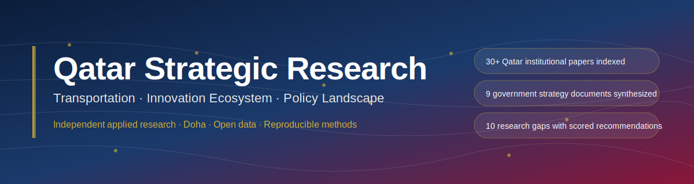
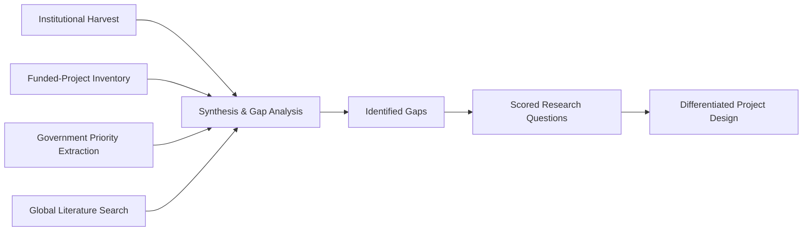

<p align="center">
  
</p>

<h1 align="center">Qatar Strategic Research</h1>

<p align="center">
  <em>Independent applied-research portfolio on Qatar's transportation infrastructure, innovation ecosystem, and policy landscape</em>
</p>

<p align="center">
  <a href="LICENSE-CONTENT"></a>
  <a href="LICENSE-CODE"></a>
  <a href="CITATION.cff"></a>
  
  
</p>

---

## Executive Summary

This repository hosts independent applied research on three intersecting domains of Qatar's national development:

1. **Transportation and infrastructure** — an ex-post gap analysis of academic and government research on Qatar's road, transit, and urban-mobility investments (2010-2026), with an identified research gap and a proposed differentiated study design.
2. **Innovation ecosystem and research funding** — a structured landscape map of Qatar's research-funding mechanisms (QRDI, QNRF, QSTP, QFTH, QFC) and regulatory pathways for applied-research delivery.
3. **Policy intelligence** — synthesis of Qatar government strategic priorities (NDS3 2024-2030, MoT Strategy 2025-2030, TMPQ 2050, TASMU, QFMP) and the gaps each opens for evidence-based research.

The flagship output is a technical report on the ex-post evaluation gap in Qatar transport infrastructure investment. A Zenodo archive of the report is planned (DOI to be added once published). The supporting analyses demonstrate the methodology and structured-data discipline applied throughout.

---

## Research Objectives

This portfolio addresses three questions of strategic importance to Qatar's national development:

1. **What has and has not been studied** in Qatar's transportation, infrastructure, and urban-mobility research base — and where do gaps align with stated government priorities?
2. **How is research currently funded and commissioned** in Qatar — and what mechanisms exist for delivery against national priorities?
3. **What new research questions** would deliver the highest value to Qatar's policy makers under existing data availability and current funding-program priorities?

The work is positioned to support decisions by:

- **Government agencies** seeking evidence baselines for policy strategy and KPI tracking
- **Research institutes and universities** identifying competitive research positioning
- **Innovation programs** (QRDI, QSTP, QFTH) calibrating call themes and award criteria
- **Consulting firms** scoping engagements aligned with Qatar's stated priorities
- **Infrastructure and transport organizations** seeking ex-post evidence on past investments

---

## Methodology



Each domain follows a structured four-phase pipeline:

1. **Harvest** — systematic collection of primary and secondary sources from Qatar institutions, government portals, international academic databases, and public datasets.
2. **Structure** — JSON-formatted inventories of papers, funded projects, priority documents, and ecosystem channels, each with verifiable source URLs.
3. **Synthesize** — gap analysis cross-referencing what has been studied, what has been funded, what government has prioritized, and what global literature has produced.
4. **Recommend** — scored research questions evaluated on novelty, feasibility, government interest, and methodological strength.

All claims are traceable to source URLs. Where a document was inaccessible (paywalled, login-gated, or returned an error), the limitation is explicit in the metadata rather than fabricated content.

See [`docs/methodology.md`](docs/methodology.md) for full methodology, scoring rubrics, and limitations.

---

## Key Findings and Recommendations

### Transportation research gap

The closest extant academic work on Doha's road network — [Spatiotemporal analysis of road network evolution and urban growth in Doha](https://www.sciencedirect.com/science/article/pii/S230718772600026X), ScienceDirect Jan 2026 — is **forward-looking and descriptive**: it identifies where Doha should grow. No published Qatar research is **backward-looking and evaluative**, testing whether ~USD 100B of road and transit investment over 2010-2025 delivered the congestion-reduction outcomes the strategies promised.

This gap is independently flagged by:

- The IMF ([PFM Blog, April 2023](https://blog-pfm.imf.org/en/pfmblog/2023/04/improving-infrastructure-investment-in-the-gcc)) as a GCC-wide weakness in public-investment management
- The Qatar Ministry of Transport itself, via the [Qatar Public Transport Master Plan (QPTMP) public survey campaign launched June 2025](https://thepeninsulaqatar.com/article/10/06/2025/mot-public-survey-to-shape-modern-public-transport-continues) — an explicit acknowledgement that the congestion baseline is not yet established

### Recommended research direction

> *"An ex-post evaluation of Qatar's road infrastructure investment (2010-2025): supply-demand mismatch, induced-demand testing, and 2030 KPI plausibility from open-data sources."*

Methodology: combine longitudinal OSM road-network history, Qatar Open Data vehicle-registration series, Comtrade vehicle imports, Doha Metro published ridership, and the TomTom Traffic Index into a panel suitable for causal-identification analysis (difference-in-differences around Metro launch; synthetic control for expressway-program completions).

### Innovation ecosystem landscape

Qatar's research-funding ecosystem restructured significantly under QRDI's 2022 reorganization. The active funding pillars for 2026 are:

- **Academic Research Program (ARP)** — including ARG, NRP, RTP, PPM
- **National Research Program (NRP)** — including QLTC (Qatar Logistics and Transportation Call), CCEC, ESC, PTP, MCSC
- **Strategic calls** — including AIQAT (with MCIT), Agentic AI (with QFC), PPM
- **Innovation pathways** — through QSTP, QFTH, QDB / Invest Qatar

Most major calls require **Lead Principal Investigator institutional affiliation** — a structural constraint with policy implications for solo and SME research-delivery capacity in Qatar.

See [`02-innovation-ecosystem-landscape/`](02-innovation-ecosystem-landscape/) for the full landscape.

---

## Repository Structure

```
qatar-strategic-research/
├── README.md                                Project overview
├── CITATION.cff                             Academic citation metadata
├── LICENSE-CONTENT                          CC-BY-4.0
├── LICENSE-CODE                             MIT
├── assets/
│   └── banner.svg                           Project banner
├── 01-transport-gap-analysis/               Flagship study — transport research gaps
│   ├── README.md
│   ├── GAP_ANALYSIS.md                      Main analytical report
│   ├── methodology.md
│   └── data/
│       ├── qatar_papers_inventory.json      30 papers from 7 Qatar institutions
│       ├── qatar_funded_projects.json       NPRP/QRDI funded projects
│       ├── qatar_gov_priorities.json        9 government strategy documents with KPIs
│       └── global_qatar_papers.json         15 international papers on Qatar transport
├── 02-innovation-ecosystem-landscape/       Qatar's research-funding ecosystem map
│   ├── README.md
│   ├── ECOSYSTEM_LANDSCAPE.md               Funding & research-commissioning analysis
│   ├── REGULATORY_FRAMEWORK.md              Regulatory pathway analysis
│   └── data/
│       └── qatar_ecosystem_channels.json    Structured channel inventory
└── docs/
    ├── methodology.md                       Cross-project methodology
    ├── data-sources.md                      Comprehensive source list
    ├── future-research.md                   Identified research opportunities
    └── author.md                            Author profile
```

---

## Data Sources

All datasets in this repository derive from publicly available sources. Each individual JSON entry carries its source URL. Aggregate sources:

- [Monaqasat — Qatar Unified State Procurement Portal](https://monaqasat.mof.gov.qa/)
- [QRDI — Qatar Research, Development and Innovation Council](https://qrdi.org.qa/)
- [Qatar Open Data Portal](https://www.data.gov.qa/)
- [QSpace — Qatar University Institutional Repository](https://qspace.qu.edu.qa/)
- [Ministry of Transport — Strategy 2025-2030](https://mot.gov.qa/)
- [TASMU Smart Qatar](https://tasmu.gov.qa/)
- [Qatar Financial Centre — Research](https://www.qfc.qa/en/media-centre/insights/research)
- [Qatar Central Bank](https://www.qcb.gov.qa/)
- [QGSO Qatar Open Data — vehicle registration series](https://www.data.gov.qa/explore/dataset/registered-vehicles-and-motor-cycles-by-type-of-license/)
- [TomTom Traffic Index — Doha](https://www.tomtom.com/traffic-index/city/doha)
- [Comtrade (UN)](https://comtradeplus.un.org/)
- ScienceDirect, MDPI, Taylor & Francis, IEEE Xplore — peer-reviewed literature

See [`docs/data-sources.md`](docs/data-sources.md) for the full annotated source list.

---

## Future Research Opportunities

The gap analysis surfaces ten specific research questions with structured scoring on novelty, feasibility, government interest, and methodological strength. The top opportunities:

1. **Ex-post evaluation of Qatar road-investment outcomes (2010-2025)** — combined OSM + Comtrade + TomTom panel analysis testing Duranton-Turner induced demand in a high-income GCC context.
2. **Supply-demand mismatch geographies** — where chronic capacity gaps persist vs. where over-supply exists.
3. **Government 2030 KPI plausibility** — quantitative assessment of 35% EV fleet, 100% e-bus, 25% GHG reduction targets against current import and registration trajectories.
4. **Doha Metro ex-post evaluation** — realized vs. projected 190,000 cars/day displacement.
5. **Three-peak daily traffic regime** — operational and welfare implications of Doha's unique 06:30 / 12:30 / 17:15 peak pattern.
6. **Climate-constrained micro-mobility viability** — heat-stress-adjusted usable hours analysis for e-scooter/e-bike investment ROI.

Full detail in [`docs/future-research.md`](docs/future-research.md).

---

## Citation

If you use or reference this work, please cite:

```bibtex
@misc{ghorbani2026_qatar_strategic_research,
  author       = {Ghorbani, Aras},
  title        = {Qatar Strategic Research: Transportation, Innovation Ecosystem, and Policy Landscape},
  year         = {2026},
  publisher    = {GitHub},
  howpublished = {\url{https://github.com/arasghorbani9090-web/qatar-strategic-research}}
}
```

A Zenodo archive with DOI will be added once the project is published there.

See [`CITATION.cff`](CITATION.cff) for machine-readable citation metadata.

---

## Author

**Aras Ghorbani** — Doha-based independent researcher and software engineer.

Background spans systems programming (Rust), algorithmic finance, applied AI/ML, and data-driven policy analysis. Active commercial registration in Qatar. Works at the intersection of quantitative methods and applied research.

- LinkedIn: [aras-ghorbani](https://www.linkedin.com/in/aras-ghorbani-ab1a7b62/)
- GitHub: [@arasghorbani9090-web](https://github.com/arasghorbani9090-web)
- Email: arasghorbani9090@gmail.com

See [`docs/author.md`](docs/author.md) for full profile.

---

## Contact

For research collaboration, commissioned studies, or methodological consultation:

- **Email:** arasghorbani9090@gmail.com
- **LinkedIn:** [aras-ghorbani](https://www.linkedin.com/in/aras-ghorbani-ab1a7b62/)
- **GitHub Issues:** open an issue on this repository for technical questions on data or methodology

---

## License

- **Research content** (Markdown reports, JSON data, analyses): [Creative Commons Attribution 4.0 International (CC-BY-4.0)](LICENSE-CONTENT)
- **Code** (scripts, tooling): [MIT License](LICENSE-CODE)

Re-use is encouraged with attribution.

---

<p align="center">
  <em>Independent strategic research · Qatar · 2026</em>
</p>
