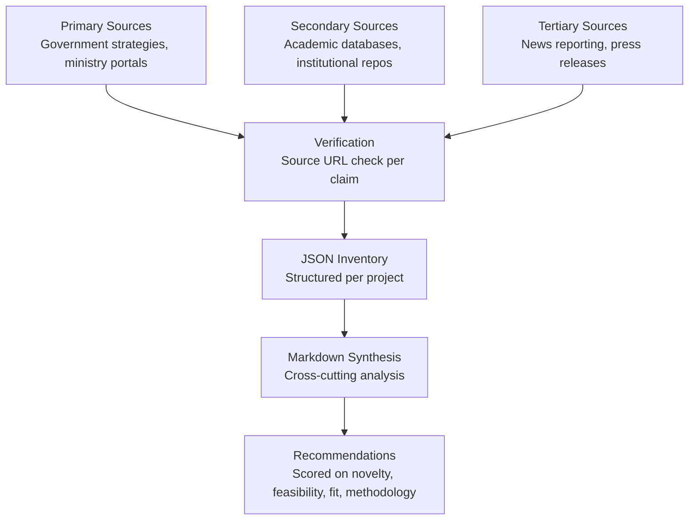

# Cross-Project Methodology

*Applies to both 01-transport-gap-analysis and 02-innovation-ecosystem-landscape. Documents the general research discipline used across the portfolio.*

## Principles

1. **Source-traceable claims.** Every assertion in any Markdown report and every entry in any JSON dataset is traceable to a public URL or explicitly marked "INACCESSIBLE" if the underlying document could not be verified.
2. **Structured-data first.** All collected information is captured in JSON schemas before being synthesized into Markdown narrative. The JSON is the source of truth; the Markdown is the synthesis.
3. **Explicit limitation declarations.** Where coverage is partial (search-surface limits, login-gated portals, paywalled abstracts), the limitation is documented in the metadata rather than masked.
4. **No fabrication.** Paper titles, authors, funding amounts, deadlines, KPIs, and URLs are not invented. When a value is unknown, the field is null or marked "unknown" rather than guessed.

## Pipeline

## Tooling

- Web search and content retrieval for source discovery
- Direct URL fetch for primary documents
- Cross-referencing across institutional, government, and academic sources
- Manual review and consistency checks
- AI assistance for narrative synthesis (with human source-checking of every cited fact)

## Scoring rubric (where used)

Identified research gaps are scored on four dimensions, 1-5 each:

| Dimension | Question |
|---|---|
| Novelty | How unique vs existing Qatar literature? |
| Feasibility | Can be executed with publicly available data and methods? |
| Government interest | Matches stated priorities in current strategic documents? |
| Methodological strength | Is a defensible, established methodology available? |

## Reproducibility

- All four JSON datasets in `01-transport-gap-analysis/data/` are append-compatible — adding a new paper requires only following the existing entry schema.
- The ecosystem channel inventory in `02-innovation-ecosystem-landscape/data/` is similarly schema-stable.
- The gap-scoring rubric is intentionally simple and human-evaluable; no machine-learning models or proprietary tooling required to re-execute or extend.

## Common limitations across the portfolio

1. **Search-surface depth.** Google, ResearchGate, institutional pages typically return ~10-20 results per query. Scopus, Web of Science, and paid academic databases are not within scope of the portfolio's open-source methodology.
2. **Login-gated portals.** Several semi-government tender portals (Kahramaa, Ooredoo, Mowasalat, Qatar Rail, Qatar Airways) require supplier registration to see live tender content; structural descriptions are derived from public-facing pages and press coverage.
3. **Arabic-only sources.** Some Qatar government and academic content is published primarily in Arabic; English-source coverage may be partial.
4. **Time-sensitive content.** Tender deadlines, funding cycles, and program statuses change frequently. Each dataset is dated; re-verification before action is recommended for any time-sensitive claim.
